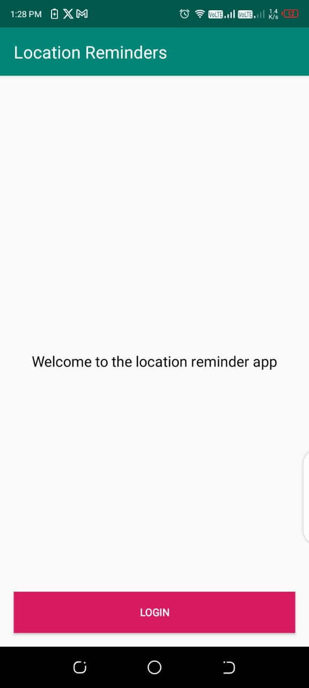
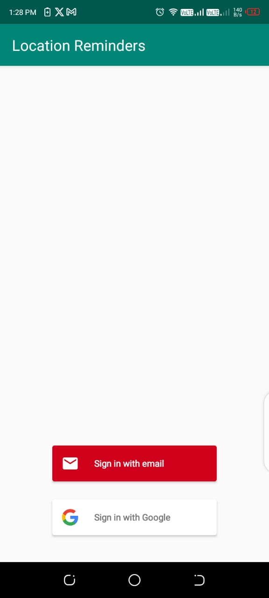
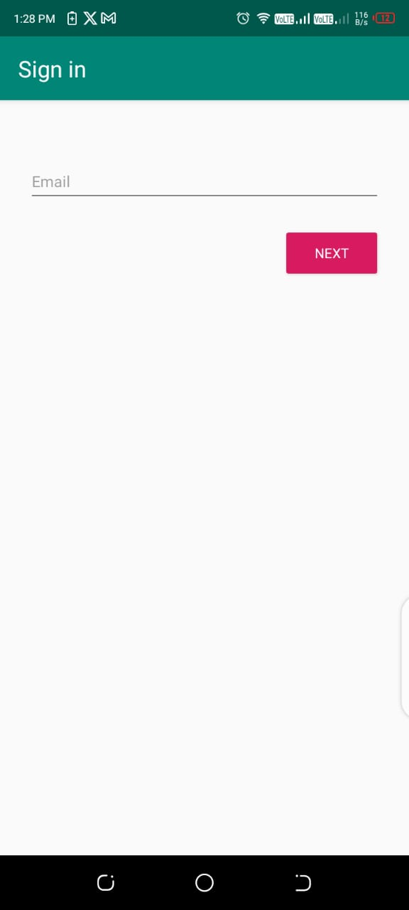
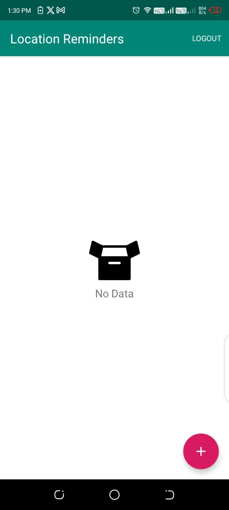
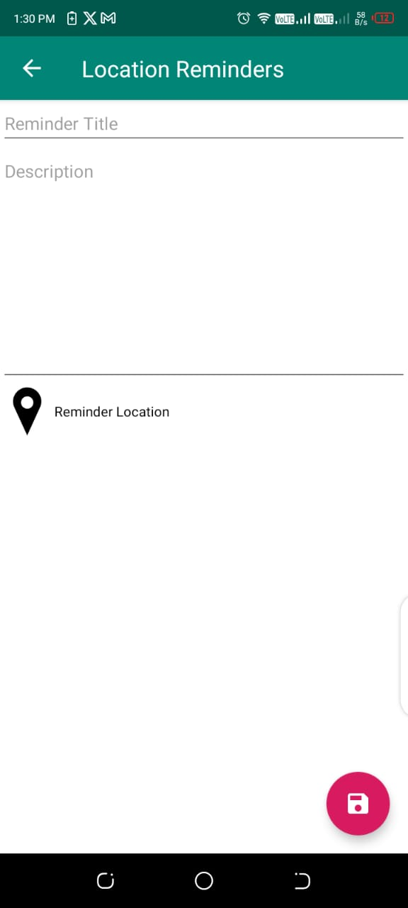
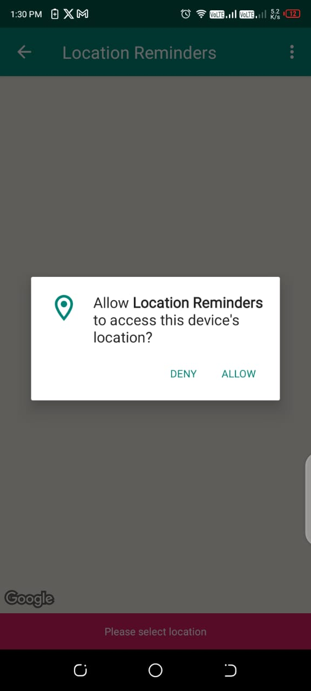
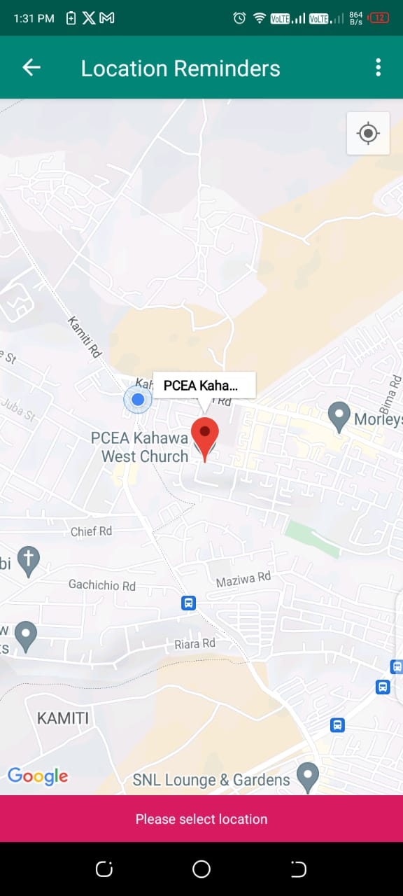
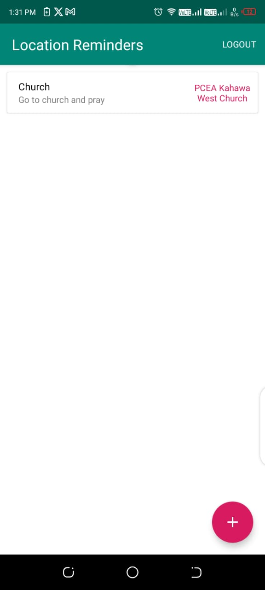

# Location-Reminder-App
Project 4: Android Kotlin Developer Udacity | Nanodegree

## APK
[Download Apk Here](https://github.com/samueljuma/Location-Reminder-App/blob/main/apk/app.apk)

### Rationale
> The App is inspired by The [Android Kotlin Developer Nanodegree Course](https://www.udacity.com/enrollment/nd940/2.0.9) on Udacity.
> It's the [fourth](https://learn.udacity.com/nanodegrees/nd940/parts/cd0638/lessons/82a52dc3-d9fa-406a-bff6-30e25dcd5e33/concepts/5a5361d1-4f89-42be-ae4c-22ecd8229d98) of the Five projects in the course.

# App Screenshots
|  |  |  |  |
|:-------------------------------:|:-------------------------------:|:-------------------------------:|:-------------------------------:|
|  |  |  |  | 
